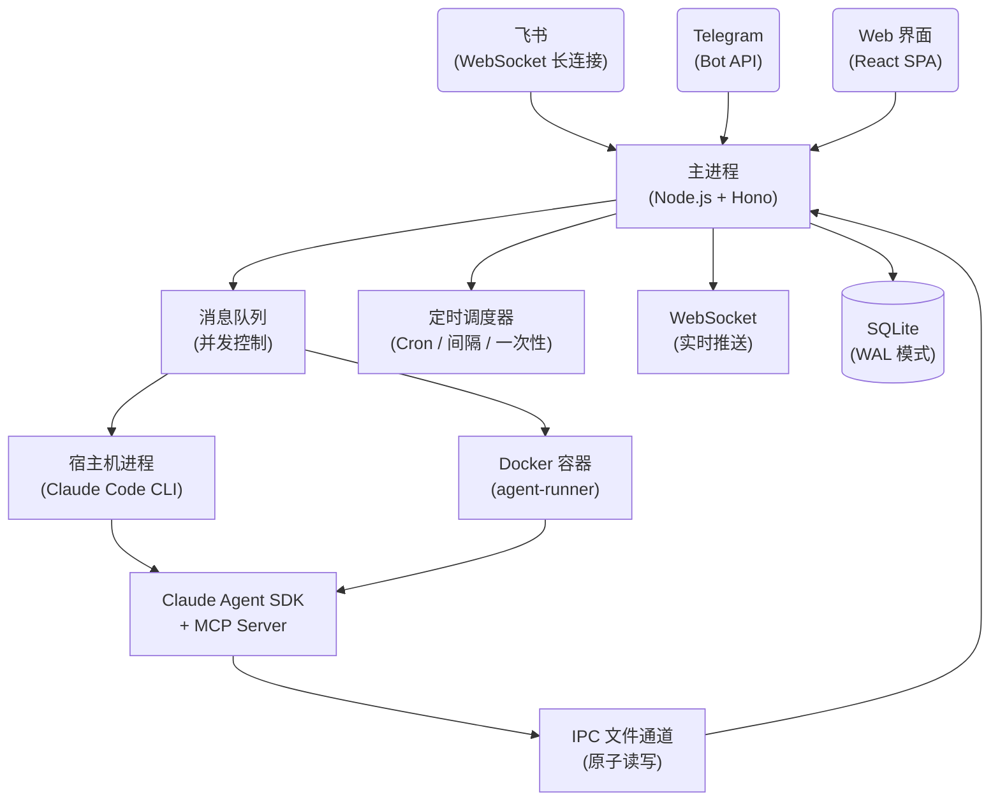

<p align="center">
  
</p>

<h1 align="center">HappyClaw</h1>

<p align="center">
  自托管 AI Agent 系统 —— 基于 Claude Code 封装，而非重新造轮子
</p>

<p align="center">
  <a href="LICENSE"></a>
  <a href="https://nodejs.org"></a>
  
  <a href="https://github.com/riba2534/happyclaw/stargazers"></a>
</p>

<p align="center">
  <a href="#为什么选择-happyclaw">理念</a> · <a href="#特性">特性</a> · <a href="#架构">架构</a> · <a href="#快速开始">快速开始</a> · <a href="#技术栈">技术栈</a> · <a href="#开发">开发</a>
</p>

---

<!-- 截图展示区
请替换为实际截图文件后取消注释：

<p align="center">
  
</p>

<details>
<summary>更多截图</summary>

| 移动端 PWA | 设置向导 | 系统监控 |
|:---------:|:-------:|:-------:|
|  |  |  |

</details>
-->

## 为什么选择 HappyClaw

世界上最好的 AI Agent 是 Claude Code。它拥有完整的文件读写、终端操作、浏览器自动化和多轮推理能力。**HappyClaw 不重新造轮子，而是直接在 Claude Code 上封装一层**，让你通过飞书、Telegram 或 Web 界面随时随地调用它。

这意味着 Claude Code 的每一次升级——新工具、更好的推理、更多的 MCP 支持——HappyClaw 都能自动受益，无需等待适配。你获得的不是一个"类 Claude"的仿制品，而是 Claude Code 本身，加上多渠道接入、会话隔离、持久记忆和任务调度。

HappyClaw 借鉴了 [OpenClaw](https://github.com/nicepkg/OpenClaw) 的容器化架构思路，结合远程办公 Agent 的理念：让 AI Agent 作为你的个人远程助手，在隔离环境中帮你调研问题、执行任务、管理文件，结果通过你习惯的 IM 渠道送达。

## 特性

### 多渠道接入

- **飞书集成** — WebSocket 长连接，富文本卡片回复，图片消息，Reaction 反馈
- **Telegram 集成** — Bot API，Markdown→HTML 渲染，长消息自动分片
- **Web 聊天** — WebSocket 实时通信，图片粘贴 / 拖拽上传，虚拟滚动
- **统一路由** — 消息原路返回，飞书来源回飞书，Web 来源回 Web

### Agent 执行引擎

- **基于 Claude Agent SDK + Claude Code CLI** — 不是调用 API，是运行完整的 Claude Code
- **宿主机模式** — Agent 直接在宿主机运行，访问本地文件系统，零 Docker 依赖
- **容器模式** — Docker 隔离执行，非 root 用户，独立工作目录
- **自定义工作目录** — 每个会话可配置 `customCwd` 指向不同项目
- **并发控制** — 最多 20 个容器 + 5 个宿主机进程，会话级队列
- **指数退避重试** — 5s → 10s → 20s → 40s → 80s，最多 5 次
- **上下文溢出自动恢复** — 对话超长时自动压缩，PreCompact Hook 归档历史

### 实时流式体验

- **思考过程实时展示** — 可折叠的 thinking 面板，逐字推送
- **工具调用实时追踪** — 工具名称、执行耗时、嵌套层级、输入参数摘要
- **调用轨迹时间线** — 最近 30 条工具调用记录，快速回溯
- **Hook 执行状态** — PreToolUse / PostToolUse Hook 的启动、进度、结果
- **流式 Markdown 渲染** — 文本增量实时渲染（GFM 表格、代码高亮、图片 Lightbox）

### 管理与扩展

- **10 个 MCP 工具** — `send_message`、`schedule_task`、`list_tasks`、`pause_task`、`resume_task`、`cancel_task`、`register_group`、`memory_append`、`memory_search`、`memory_get`
- **定时任务** — Cron / 固定间隔 / 一次性三种模式，group / isolated 上下文，执行日志
- **Skills 系统** — 项目级 + 用户级，volume 挂载自动发现，无需重建镜像
- **记忆系统** — 全局 + 会话级 `CLAUDE.md`，日期记忆文件，全文检索，Web 在线编辑，PreCompact 归档
- **Web 终端** — 基于 xterm.js + node-pty，WebSocket 连接，可拖拽调整面板
- **文件管理** — 上传（50MB）/ 下载 / 删除，目录管理，图片预览，拖拽上传
- **容器环境变量** — 全局配置 + 群组级覆盖，变更审计日志

### 安全与运维

- **多用户 RBAC** — 5 种权限，4 种模板（admin_full / member_basic / ops_manager / user_admin）
- **邀请码注册** — 可配置开放注册 / 邀请码 / 关闭注册
- **审计日志** — 18 种事件类型，完整操作追踪
- **AES-256-GCM 加密** — API 密钥加密存储，Web API 仅返回掩码值
- **路径遍历防护** — normalize + realpath + 符号链接检测，系统路径保护
- **挂载安全** — 白名单校验 + 黑名单模式匹配（`.ssh`、`.gnupg` 等敏感路径）
- **登录限流** — 5 次失败锁定 15 分钟，会话管理（30 天有效期）
- **PWA 支持** — 可安装为桌面 / 移动应用，iOS 适配，离线缓存
- **零配置设置向导** — 首次访问引导完成管理员创建和服务配置

## 架构



主进程以 2 秒间隔轮询新消息，分发到并发队列（最多 20 个容器 + 5 个宿主机进程）。容器或宿主机进程中的 `agent-runner` 调用 Claude Agent SDK 的 `query()` 函数，流式输出通过 stdout 标记协议传回主进程，再经 WebSocket 广播到 Web 客户端或通过 IM API 回复到飞书 / Telegram。MCP Server 通过基于文件的 IPC 提供 10 个工具与主进程通信。

## 快速开始

### 前置要求

- **Node.js** >= 20
- **[Claude Code CLI](https://docs.anthropic.com/en/docs/claude-code)** — 宿主机模式必需（`npm install -g @anthropic-ai/claude-code`）
- **Claude API 密钥** — Anthropic 官方或兼容的中转服务
- **Docker Desktop**（可选）— 仅容器模式需要
- **飞书企业自建应用凭据**（可选）— 仅飞书集成需要
- **Telegram Bot Token**（可选）— 仅 Telegram 集成需要

### 安装和启动

```bash
# 1. 克隆
git clone https://github.com/riba2534/happyclaw.git && cd happyclaw

# 2. 安装 Claude Code CLI（宿主机模式必需）
npm install -g @anthropic-ai/claude-code

# 3. 一键启动（首次自动安装依赖 + 编译）
make start
```

浏览器打开 `http://localhost:3000`，首次访问会引导创建管理员账号（自定义用户名和密码）。

登录后在**设置**页面配置 Claude API 和 IM 集成。所有配置通过 Web 界面完成，无需手动编辑 `.env` 文件。

> **开发者？** 使用 `make dev` 替代 `make start`，前后端均支持热更新。

## 执行模式

HappyClaw 支持两种 Agent 执行模式：

| 模式 | 说明 | 前置要求 |
|------|------|---------|
| **宿主机模式**（默认） | Agent 直接在宿主机运行，访问本地文件系统 | Claude Code CLI |
| **容器模式** | Agent 在 Docker 容器中隔离运行，非 root 用户 | Docker Desktop + 构建镜像 |

主会话默认使用宿主机模式，开箱即用无需 Docker。如需容器模式，先构建镜像：

```bash
./container/build.sh
```

然后在 Web 管理界面中将对应会话的执行模式切换为「容器模式」。

## 容器工具链

容器镜像基于 `node:22-slim`，预装以下工具：

| 类别 | 工具 |
|------|------|
| 浏览器自动化 | Chromium、agent-browser |
| AI / Agent | Claude Code CLI、Claude Agent SDK、MCP SDK |
| 编程语言 | Node.js 22、Python 3、uv / uvx |
| 编译构建 | build-essential、cmake、pkg-config |
| 文本搜索 | ripgrep (`rg`)、fd-find (`fd`) |
| 多媒体处理 | ffmpeg、ImageMagick、Ghostscript、Graphviz |
| 文档转换 | Pandoc、poppler-utils（PDF 工具） |
| 数据库客户端 | SQLite3、MySQL Client、PostgreSQL Client、Redis Tools |
| 网络工具 | curl、wget、openssh-client、dnsutils |
| Shell | Zsh + Oh My Zsh（ys 主题） |
| 其他 | git、jq、tree、shellcheck、zip/unzip |

## 技术栈

| 层次 | 技术 |
|------|------|
| **后端** | Node.js 22 · TypeScript 5.7 · Hono · better-sqlite3 (WAL) · ws · node-pty · Pino · Zod |
| **前端** | React 19 · Vite 6 · Zustand 5 · Tailwind CSS 4 · shadcn/ui · react-markdown · xterm.js · @tanstack/react-virtual · PWA |
| **容器** | Docker (node:22-slim) · Claude Agent SDK · Claude Code CLI · MCP SDK · Chromium · agent-browser |
| **安全** | bcrypt (12 轮) · AES-256-GCM · HMAC Cookie · RBAC · 路径遍历防护 · 挂载白名单 |

## 目录结构

```
happyclaw/
├── src/                          # 后端源码
│   ├── index.ts                  #   入口：消息轮询、IPC 监听、容器生命周期
│   ├── web.ts                    #   Hono 应用、WebSocket、静态文件
│   ├── routes/                   #   路由（auth / groups / files / config / monitor / memory / tasks / skills / admin）
│   ├── feishu.ts                 #   飞书 WebSocket 长连接
│   ├── telegram.ts               #   Telegram Bot 集成
│   ├── container-runner.ts       #   Docker / 宿主机进程管理
│   ├── group-queue.ts            #   并发控制队列
│   ├── runtime-config.ts         #   AES-256-GCM 加密配置
│   ├── task-scheduler.ts         #   定时任务调度
│   ├── file-manager.ts           #   文件安全（路径遍历防护）
│   ├── mount-security.ts         #   挂载白名单 / 黑名单
│   └── db.ts                     #   SQLite 数据层（Schema v1→v10）
│
├── web/                          # 前端 (React + Vite)
│   └── src/
│       ├── pages/                #   12 个页面
│       ├── components/           #   UI 组件（shadcn/ui）
│       ├── stores/               #   9 个 Zustand Store
│       └── api/client.ts         #   统一 API 客户端
│
├── container/                    # Agent 容器
│   ├── Dockerfile                #   容器镜像定义
│   ├── build.sh                  #   构建脚本
│   ├── agent-runner/             #   容器内执行引擎
│   │   └── src/
│   │       ├── index.ts          #     Agent 主循环 + 流式事件
│   │       └── ipc-mcp-stdio.ts  #     10 个 MCP 工具
│   └── skills/                   #   项目级 Skills
│
├── config/                       # 项目配置
│   ├── default-groups.json       #   预注册群组
│   └── mount-allowlist.json      #   容器挂载白名单
│
├── groups/                       # 会话工作目录（运行时生成）
├── data/                         # 运行时数据（加密配置、IPC、会话）
├── store/                        # SQLite 数据库
└── Makefile                      # 常用命令
```

## Web 页面

| 页面 | 路由 | 功能 |
|------|------|------|
| 设置向导 | `/setup` | 首次启动配置引导 |
| 登录 | `/login` | 用户名密码认证 |
| 注册 | `/register` | 新用户注册（可配置开关） |
| 聊天 | `/chat/:groupFolder?` | 消息收发、流式显示、思考过程 |
| 群组 | `/groups` | 会话管理、执行模式切换 |
| 任务 | `/tasks` | 定时任务管理 + 执行日志 |
| 监控 | `/monitor` | 容器状态、队列、系统信息 |
| 记忆 | `/memory` | 记忆文件编辑 + 全文检索 |
| Skills | `/skills` | Skills 列表与管理 |
| 设置 | `/settings` | Claude / 飞书 / Telegram 配置 |
| 用户 | `/users` | 用户管理（管理员） |
| 更多 | `/more` | 移动端聚合导航 |

## 开发

```bash
make dev              # 前后端并行启动（热更新）
make dev-backend      # 仅后端
make dev-web          # 仅前端
make build            # 编译全部（后端 + 前端 + agent-runner）
make start            # 一键启动生产环境
make typecheck        # TypeScript 全量类型检查
make format           # 代码格式化（Prettier）
make clean            # 清理构建产物
```

| 服务 | 端口 |
|------|------|
| 后端（Hono + WebSocket） | 3000 |
| 前端开发服务器（Vite） | 5173（代理 `/api` 和 `/ws` 到 3000） |

## 环境变量

以下为可选覆盖项。推荐使用 Web 设置向导配置 Claude API 和 IM 凭据（加密存储）。

| 变量 | 默认值 | 说明 |
|------|--------|------|
| `WEB_PORT` | `3000` | Web 服务端口 |
| `ASSISTANT_NAME` | `HappyClaw` | 助手显示名称 |
| `CONTAINER_IMAGE` | `happyclaw-agent:latest` | Agent 容器镜像 |
| `CONTAINER_TIMEOUT` | `1800000`（30min） | 容器硬超时 |
| `IDLE_TIMEOUT` | `1800000`（30min） | 容器空闲保活时长 |
| `MAX_CONCURRENT_HOST_PROCESSES` | `5` | 宿主机进程并发上限 |
| `TZ` | 系统时区 | 定时任务时区 |

## 管理员密码恢复

```bash
npm run reset:admin -- <用户名> <新密码>
```

## 数据重置

如需重置为全新状态：

```bash
make reset-init
# 或手动：
rm -f store/messages.db
rm -rf data/sessions/ data/ipc/ data/env/
rm -rf groups/flow-*
# 可选：rm -rf data/config/  （移除加密配置）
```

## Star History

<a href="https://star-history.com/#riba2534/happyclaw&Date">
  <picture>
    <source media="(prefers-color-scheme: dark)" srcset="https://api.star-history.com/svg?repos=riba2534/happyclaw&type=Date&theme=dark" />
    <source media="(prefers-color-scheme: light)" srcset="https://api.star-history.com/svg?repos=riba2534/happyclaw&type=Date" />
    
  </picture>
</a>

## 许可证

[MIT](LICENSE)
