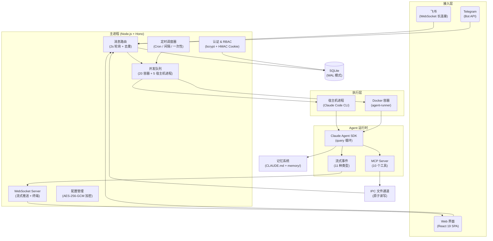

<p align="center">
  
</p>

<h1 align="center">HappyClaw</h1>

<p align="center">
  自托管的多用户本地 AI Agent 系统 — Powered By Claude Code.
</p>

<p align="center">
  <a href="LICENSE"></a>
  <a href="https://nodejs.org"></a>
  
  <a href="https://github.com/riba2534/happyclaw/stargazers"></a>
</p>

<p align="center">
  <a href="#happyclaw-是什么">介绍</a> · <a href="#核心能力">核心能力</a> · <a href="#快速开始">快速开始</a> · <a href="#技术架构">技术架构</a> · <a href="#贡献">贡献</a>
</p>

---

| 聊天界面 — 工具调用追踪 | 聊天界面 — Markdown 渲染 | 聊天界面 — 图片生成 + 文件管理 |
|:--------------------:|:-------------------:|:----------------------:|
|  |  |  |

<details>
<summary>📸 更多截图</summary>
<br/>

**设置向导**

| 创建管理员 | 配置接入（飞书 + Claude） |
|:--------:|:---------------------:|
|  |  |

**移动端 PWA**

| 登录 | 工作区 | 系统监控 | 设置 |
|:---:|:-----:|:------:|:---:|
|  |  |  |  |

**飞书集成**

| Bot 聊天 | 富文本卡片回复 |
|:-------:|:----------:|
|  |  |

</details>

## HappyClaw 是什么

HappyClaw 是一个基于 [Claude Agent SDK](https://github.com/anthropics/claude-code/tree/main/packages/claude-agent-sdk) 构建的自托管多用户 AI Agent 系统。它将完整的 Claude Code 运行时封装为可通过飞书、Telegram 和 Web 界面访问的服务，支持文件读写、终端操作、浏览器自动化、多轮推理及 MCP 工具生态。

核心设计原则：**不重新实现 Agent 能力，直接复用 Claude Code**。底层调用的是完整的 Claude Code CLI 运行时，而非 API Wrapper 或 Prompt Chain。Claude Code 的每次升级——新工具、更强的推理、更多的 MCP 支持——HappyClaw 零适配自动受益。

### 关键特性

- **原生 Claude Code 驱动** — 基于 Claude Agent SDK，底层为完整的 Claude Code CLI 运行时，继承其全部能力
- **多用户隔离** — Per-user 工作区、Per-user IM 通道、RBAC 权限体系、邀请码注册、审计日志，每个用户拥有独立的执行环境
- **移动端 PWA** — 针对移动端深度优化，支持一键安装到桌面，iOS / Android 均已适配，随时随地通过手机访问 AI Agent
- **飞书深度集成** — WebSocket 长连接实时通信、富文本卡片渲染、Reaction 反馈、自动注册群组，同时支持 Telegram Bot 和 Web 界面，三端消息统一路由

> 项目借鉴了 [OpenClaw](https://github.com/nicepkg/OpenClaw) 的容器化架构，并融合了 Claude Code 官方 [Cowork](https://github.com/anthropics/claude-code/tree/main/packages/cowork) 的多会话协作思路：多个独立 Agent 会话并行工作，各自拥有隔离的工作空间和持久记忆，结果通过 IM 渠道送达。

## 核心能力

### 多渠道接入

| 渠道 | 连接方式 | 消息格式 | 特色 |
|------|---------|---------|------|
| **飞书** | WebSocket 长连接 | 富文本卡片 | 图片消息、Reaction 反馈、自动注册群组 |
| **Telegram** | Bot API (Long Polling) | Markdown → HTML | 长消息自动分片（3800 字符） |
| **Web** | WebSocket 实时通信 | 流式 Markdown | 图片粘贴/拖拽上传、虚拟滚动 |

每个用户可独立配置自己的 IM 通道（飞书应用凭据、Telegram Bot Token），互不干扰。消息统一路由：飞书来源回飞书，Telegram 来源回 Telegram，Web 来源回 Web。


### Agent 执行引擎

基于 [Claude Agent SDK](https://github.com/anthropics/claude-code/tree/main/packages/claude-agent-sdk) 构建，SDK 底层调用完整的 Claude Code CLI。

- **Per-user 主工作区** — 每个用户拥有一个固定的主工作区（admin 使用宿主机模式，member 使用容器模式），IM 消息路由到各自的主工作区
- **宿主机模式** — Agent 直接在宿主机运行，访问本地文件系统，零 Docker 依赖（admin 主工作区默认模式）
- **容器模式** — Docker 隔离执行，非 root 用户，预装 40+ 工具（member 主工作区默认模式）
- **多会话并发** — 最多 20 个容器 + 5 个宿主机进程同时运行，会话级队列调度
- **自定义工作目录** — 每个会话可配置 `customCwd` 指向不同项目
- **失败自动恢复** — 指数退避重试（5s → 80s，最多 5 次），上下文溢出自动压缩并归档历史


### 实时流式体验

Agent 的思考和执行过程实时推送到前端，而非等待最终结果：

- **思考过程** — 可折叠的 Extended Thinking 面板，逐字推送
- **工具调用追踪** — 工具名称、执行耗时、嵌套层级、输入参数摘要
- **调用轨迹时间线** — 最近 30 条工具调用记录，快速回溯
- **Hook 执行状态** — PreToolUse / PostToolUse Hook 的启动、进度、结果
- **流式 Markdown 渲染** — GFM 表格、代码高亮、图片 Lightbox


### 10 个 MCP 工具

Agent 在运行时可通过内置 MCP Server 与主进程通信：

| 工具 | 说明 |
|------|------|
| `send_message` | 运行期间即时发送消息给用户/群组 |
| `schedule_task` | 创建定时/周期/一次性任务（cron / interval / once） |
| `list_tasks` | 列出定时任务 |
| `pause_task` / `resume_task` / `cancel_task` | 暂停、恢复、取消任务 |
| `register_group` | 注册新群组（仅 admin 主工作区） |
| `memory_append` | 追加时效性记忆到 `memory/YYYY-MM-DD.md` |
| `memory_search` | 全文检索工作区记忆文件 |
| `memory_get` | 读取记忆文件内容 |

### 定时任务

- 三种调度模式：**Cron 表达式** / **固定间隔** / **一次性执行**
- 两种上下文模式：`group`（在指定会话中执行）/ `isolated`（独立隔离环境）
- 完整的执行日志（耗时、状态、结果），Web 界面管理


### 记忆系统

Agent 自主维护跨会话的持久记忆：

- **用户全局记忆** — `data/groups/user-global/{userId}/CLAUDE.md`，每个用户独立的全局记忆，所有会话可读
- **会话记忆** — `data/groups/{folder}/CLAUDE.md`，会话私有
- **日期记忆** — `memory/YYYY-MM-DD.md`，时效性信息
- **对话归档** — PreCompact Hook 在上下文压缩前自动归档到 `conversations/`
- **全文检索** — Web 界面在线编辑 + 搜索


### Skills 系统

- **项目级 Skills** — 放在 `container/skills/`，所有容器自动挂载
- **用户级 Skills** — 放在 `~/.claude/skills/`，所有容器自动挂载
- 无需重建镜像，volume 挂载 + 符号链接自动发现

### Web 终端

基于 xterm.js + node-pty 的完整终端：WebSocket 连接，可拖拽调整面板，直接在 Web 界面中操作服务器。


### 移动端 PWA

专为移动端优化的 Progressive Web App，手机浏览器一键安装到桌面：

- **原生体验** — 全屏模式运行，独立的应用图标，视觉上与原生 App 无异
- **响应式布局** — 移动端优先设计，聊天界面、设置页面、监控面板均适配小屏幕
- **iOS / Android 适配** — 安全区域适配、滚动优化、字体渲染、触摸交互
- **随时可用** — 任何时间、任何地点，掏出手机就能与 AI Agent 对话、查看执行状态、管理任务


### 文件管理

上传（50MB 限制）/ 下载 / 删除，目录管理，图片预览，拖拽上传。路径遍历防护 + 系统路径保护。

### 安全与多用户

| 能力 | 说明 |
|------|------|
| **用户隔离** | 每个用户拥有独立的主工作区（`home-{userId}`）、工作目录、IM 通道 |
| **个性化设置** | 用户可自定义 AI 名称、头像 emoji 和颜色 |
| **RBAC** | 5 种权限，4 种角色模板（admin_full / member_basic / ops_manager / user_admin） |
| **注册控制** | 开放注册 / 邀请码注册 / 关闭注册 |
| **审计日志** | 18 种事件类型，完整操作追踪 |
| **加密存储** | API 密钥 AES-256-GCM 加密，Web API 仅返回掩码值 |
| **挂载安全** | 白名单校验 + 黑名单模式匹配（`.ssh`、`.gnupg` 等敏感路径） |
| **终端权限** | 用户可访问自己容器的 Web 终端（宿主机模式不支持） |
| **登录保护** | 5 次失败锁定 15 分钟，bcrypt 12 轮，HMAC Cookie，30 天会话有效期 |
| **PWA** | 一键安装到手机桌面，移动端深度优化，随时随地使用 AI Agent |

## 快速开始

### 前置要求

开始之前，请确保以下依赖已安装：

**必需**

- **[Node.js](https://nodejs.org) >= 20** — 运行主服务和前端构建
  - macOS: `brew install node`
  - Linux: 参考 [NodeSource](https://github.com/nodesource/distributions) 或使用 `nvm`
  - Windows: [官网下载](https://nodejs.org)

- **[Docker](https://www.docker.com/)** — 容器模式运行 Agent（member 用户需要；admin 仅宿主机模式可不装）
  - macOS: 推荐 [OrbStack](https://orbstack.dev)（更轻量），也可用 [Docker Desktop](https://www.docker.com/products/docker-desktop/)
  - Linux: `curl -fsSL https://get.docker.com | sh`
  - Windows: [Docker Desktop](https://www.docker.com/products/docker-desktop/)

- **Claude API 密钥** — Anthropic 官方或兼容的中转服务(各种 Coding Plan)，启动后在 Web 界面中配置

**可选**

- 飞书企业自建应用凭据 — 仅飞书集成需要，前往 [飞书开放平台](https://open.feishu.cn) 创建
- Telegram Bot Token — 仅 Telegram 集成需要，通过 [@BotFather](https://t.me/BotFather) 获取

> Claude Code CLI 无需手动安装——项目依赖的 Claude Agent SDK 已内置完整的 CLI 运行时，`make start` 首次启动时自动安装。

### 安装启动

```bash
# 1. 克隆仓库
git clone https://github.com/riba2534/happyclaw.git
cd happyclaw

# 2. 一键启动（首次自动安装依赖 + 编译）
make start

访问： http://localhost:3000

如需公网访问，可以自行使用 nginx/caddy 配置反向代理
```

按照设置向导完成初始化：

1. **创建管理员** — 自定义用户名和密码（无默认账号）
2. **配置 Claude API** — 填入 API 密钥和模型（支持中转服务）
3. **配置 IM 通道**（可选）— 飞书 App ID/Secret 或 Telegram Bot Token
4. **开始对话** — 在 Web 聊天页面直接发送消息

> 所有配置通过 Web 界面完成，无需手动编辑 `.env` 文件。API 密钥 AES-256-GCM 加密存储。


### 启用容器模式

admin 用户默认使用宿主机模式（无需 Docker），开箱即用。如果需要容器模式（member 用户注册后自动使用）：

```bash
# 构建容器镜像
./container/build.sh
```

新用户注册后会自动创建容器模式的主工作区（`home-{userId}`），无需额外配置。

### 配置飞书集成

1. 前往 [飞书开放平台](https://open.feishu.cn)，创建企业自建应用
2. 在应用的「事件订阅」中添加：`im.message.receive_v1`（接收消息）
3. 在应用的「权限管理」中开通：`im:message`（发送消息）、`im:message.receive_v3`（接收消息）
4. 发布应用版本并等待审批通过
5. 在 HappyClaw Web 界面的「设置 → IM 通道 → 飞书」中填入 App ID 和 App Secret

每个用户可在个人设置中独立配置飞书应用凭据，实现 per-user 的飞书 Bot。


### 配置 Telegram 集成

1. 在 Telegram 中搜索 [@BotFather](https://t.me/BotFather)，发送 `/newbot` 创建 Bot
2. 记录返回的 Bot Token
3. 在 HappyClaw Web 界面的「设置 → IM 通道 → Telegram」中填入 Bot Token


### 执行模式

| 模式 | 说明 | 适用对象 | 前置要求 |
|------|------|---------|---------|
| **宿主机模式** | Agent 直接在宿主机运行，访问本地文件系统 | admin 主工作区（`folder=main`） | Claude Agent SDK（自动安装） |
| **容器模式** | Agent 在 Docker 容器中隔离运行，预装 40+ 工具 | member 主工作区（`folder=home-{userId}`） | Docker Desktop + 构建镜像 |

admin 主工作区默认使用宿主机模式，member 注册后自动创建容器模式的主工作区。也可在 Web 界面的会话管理中手动切换执行模式。

### 容器工具链

容器镜像基于 `node:22-slim`，预装以下工具：

| 类别 | 工具 |
|------|------|
| AI / Agent | Claude Code CLI、Claude Agent SDK、MCP SDK |
| 浏览器自动化 | Chromium、agent-browser |
| 编程语言 | Node.js 22、Python 3、uv / uvx |
| 编译构建 | build-essential、cmake、pkg-config |
| 文本搜索 | ripgrep (`rg`)、fd-find (`fd`) |
| 多媒体处理 | ffmpeg、ImageMagick、Ghostscript、Graphviz |
| 文档转换 | Pandoc、poppler-utils（PDF 工具） |
| 数据库客户端 | SQLite3、MySQL Client、PostgreSQL Client、Redis Tools |
| 网络工具 | curl、wget、openssh-client、dnsutils |
| Shell | Zsh + Oh My Zsh（ys 主题） |
| 其他 | git、jq、tree、shellcheck、zip/unzip |

## 技术架构

### 架构图



**数据流**：消息从接入层进入主进程，经去重和路由后分发到并发队列。队列启动宿主机进程或 Docker 容器，内部的 agent-runner 调用 Claude Agent SDK 的 `query()` 函数。流式事件（思考、文本、工具调用等 11 种类型）通过 stdout 标记协议传回主进程，再经 WebSocket 广播到 Web 客户端或通过 IM API 回复到飞书/Telegram。MCP Server 通过基于文件的 IPC 通道提供 10 个工具，实现 Agent 与主进程的双向通信。

### 技术栈

| 层次 | 技术 |
|------|------|
| **后端** | Node.js 22 · TypeScript 5.7 · Hono · better-sqlite3 (WAL) · ws · node-pty · Pino · Zod |
| **前端** | React 19 · Vite 6 · Zustand 5 · Tailwind CSS 4 · shadcn/ui · react-markdown · xterm.js · @tanstack/react-virtual · PWA |
| **Agent** | Claude Agent SDK · Claude Code CLI · MCP SDK · IPC 文件通道 |
| **容器** | Docker (node:22-slim) · Chromium · agent-browser · Python · 40+ 预装工具 |
| **安全** | bcrypt (12 轮) · AES-256-GCM · HMAC Cookie · RBAC · 路径遍历防护 · 挂载白名单 |
| **IM 集成** | @larksuiteoapi/node-sdk (飞书) · grammY (Telegram) |

### 目录结构

所有运行时数据统一在 `data/` 目录下，启动时自动创建，无需手动初始化。

```
happyclaw/
├── src/                          # 后端源码
│   ├── index.ts                  #   入口：消息轮询、IPC 监听、容器生命周期
│   ├── web.ts                    #   Hono 应用、WebSocket、静态文件
│   ├── routes/                   #   路由（auth / groups / files / config / monitor / memory / tasks / skills / admin）
│   ├── feishu.ts                 #   飞书连接工厂（WebSocket 长连接）
│   ├── telegram.ts               #   Telegram 连接工厂（Bot API）
│   ├── im-manager.ts             #   IM 连接池（per-user 飞书/Telegram 连接管理）
│   ├── container-runner.ts       #   Docker / 宿主机进程管理
│   ├── group-queue.ts            #   并发控制队列
│   ├── runtime-config.ts         #   AES-256-GCM 加密配置
│   ├── task-scheduler.ts         #   定时任务调度
│   ├── file-manager.ts           #   文件安全（路径遍历防护）
│   ├── mount-security.ts         #   挂载白名单 / 黑名单
│   └── db.ts                     #   SQLite 数据层（Schema v1→v13）
│
├── web/                          # 前端 (React + Vite)
│   └── src/
│       ├── pages/                #   12 个页面
│       ├── components/           #   UI 组件（shadcn/ui）
│       ├── stores/               #   9 个 Zustand Store
│       └── api/client.ts         #   统一 API 客户端
│
├── container/                    # Agent 容器
│   ├── Dockerfile                #   容器镜像定义
│   ├── build.sh                  #   构建脚本
│   ├── agent-runner/             #   容器内执行引擎
│   │   └── src/
│   │       ├── index.ts          #     Agent 主循环 + 流式事件
│   │       └── ipc-mcp-stdio.ts  #     10 个 MCP 工具
│   └── skills/                   #   项目级 Skills
│
├── config/                       # 项目配置
│   ├── default-groups.json       #   预注册群组
│   └── mount-allowlist.json      #   容器挂载白名单
│
├── data/                         # 运行时数据（启动时自动创建）
│   ├── db/messages.db            #   SQLite 数据库（WAL 模式）
│   ├── groups/{folder}/          #   会话工作目录（Agent 可读写）
│   ├── groups/user-global/{id}/  #   用户全局记忆目录
│   ├── sessions/{folder}/.claude/#   Claude 会话持久化
│   ├── ipc/{folder}/             #   IPC 通道（input / messages / tasks）
│   ├── env/{folder}/env          #   容器环境变量文件
│   ├── memory/{folder}/          #   日期记忆
│   └── config/                   #   加密配置文件
│
└── Makefile                      # 常用命令
```

### 开发指南

```bash
make dev              # 前后端并行启动（热更新）
make dev-backend      # 仅启动后端
make dev-web          # 仅启动前端
make build            # 编译全部（后端 + 前端 + agent-runner）
make start            # 一键启动生产环境
make typecheck        # TypeScript 全量类型检查
make format           # 代码格式化（Prettier）
make clean            # 清理构建产物
make reset-init       # 重置为首装状态（清空数据库、配置、工作区、记忆、会话）
```

| 服务 | 默认端口 | 说明 |
|------|---------|------|
| 后端 | 3000 | Hono + WebSocket |
| 前端开发服务器 | 5173 | Vite，代理 `/api` 和 `/ws` 到后端（仅开发模式） |

#### 自定义端口

**生产模式**（`make start`）：只有后端服务，前端作为静态文件由后端托管，通过 `WEB_PORT` 环境变量修改端口：

```bash
# 方式一：.env 文件
echo "WEB_PORT=8080" >> .env
make start
# 访问 http://localhost:8080

# 方式二：命令行传入
WEB_PORT=8080 make start
```

**开发模式**（`make dev`）：前端 Vite 开发服务器（`5173`）和后端（`3000`）分别运行，开发时访问 `5173`。

修改后端端口：

```bash
# 后端改为 8080（通过 .env 或环境变量）
WEB_PORT=8080 make dev-backend

# 前端需同步修改代理目标，否则 API 请求会发到默认的 3000
VITE_API_PROXY_TARGET=http://127.0.0.1:8080 VITE_WS_PROXY_TARGET=ws://127.0.0.1:8080 make dev-web
```

修改前端端口：通过 Vite CLI 参数覆盖：

```bash
cd web && npx vite --port 3001
```

### 环境变量

以下为可选覆盖项。推荐使用 Web 设置向导配置 Claude API 和 IM 凭据（加密存储）。

| 变量 | 默认值 | 说明 |
|------|--------|------|
| `WEB_PORT` | `3000` | Web 服务端口 |
| `ASSISTANT_NAME` | `HappyClaw` | 助手显示名称 |
| `CONTAINER_IMAGE` | `happyclaw-agent:latest` | Agent 容器镜像 |
| `CONTAINER_TIMEOUT` | `1800000`（30min） | 容器硬超时 |
| `IDLE_TIMEOUT` | `1800000`（30min） | 容器空闲保活时长 |
| `MAX_CONCURRENT_HOST_PROCESSES` | `5` | 宿主机进程并发上限 |
| `TZ` | 系统时区 | 定时任务时区 |

### 管理员密码恢复

```bash
npm run reset:admin -- <用户名> <新密码>
```

### 数据重置

```bash
make reset-init

# 或手动：
rm -rf data store groups
```

## 贡献

欢迎提交 Issue 和 Pull Request！

### 开发流程

1. Fork 仓库并克隆到本地
2. 创建功能分支：`git checkout -b feature/your-feature`
3. 开发并测试：`make dev` 启动开发环境，`make typecheck` 检查类型
4. 提交代码并推送到 Fork
5. 创建 Pull Request 到 `main` 分支

### Commit 规范

Commit message 使用简体中文，格式：`类型: 描述`

```
修复: 侧边栏下拉菜单无法点击
新增: Telegram Bot 集成
重构: 统一消息路由逻辑
```

### 项目结构

项目包含三个独立的 Node.js 项目，各有独立的 `package.json` 和 `tsconfig.json`：

| 项目 | 目录 | 用途 |
|------|------|------|
| 主服务 | `/`（根目录） | 后端服务 |
| Web 前端 | `web/` | React SPA |
| Agent Runner | `container/agent-runner/` | 容器/宿主机内执行引擎 |

## Star History

[](https://www.star-history.com/#riba2534/happyclaw&type=date&legend=top-left)

## 许可证

[MIT](LICENSE)
